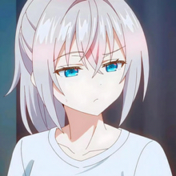

# Implicit Neural Representations

[](https://github.com/josedelrey/implicit-neural-representations/actions/workflows/ci.yml)
[](https://www.python.org/)
[](https://pytorch.org/)
[](LICENSE)

Experiments with implicit neural representations for images and videos. Each
network is fitted to a single signal, mapping spatial or spatiotemporal
coordinates to pixel values. Implemented models include established INR
architectures and local wavelet variants of multiplicative filter networks.

|  |  |  |
| --- | --- | --- |

## Models

| Model name | Architecture |
| --- | --- |
| `mlp` | MLP baseline with configurable activation and optional positional encoding |
| `siren` | Sinusoidal representation network |
| `fouriernet` | Multiplicative filter network with Fourier filters |
| `gabornet` | Multiplicative filter network with Gabor filters |
| `waveletnet` | Local MFN variant with wavelet filters |
| `waveletnetnormalized` | Local wavelet MFN with normalized hidden states |
| `vectorwaveletnetnormalized` | Normalized wavelet MFN with a frequency scale for each coordinate axis |
| `wire` | Complex Gabor wavelet network with real-valued output |
| `finer` | Variable-periodic activation network based on FINER++ |
| `frinr` | ReLU and sinusoidal networks with optional Fourier reparameterization |

Architecture code lives in
[`implicit_neural_representations/architectures/`](implicit_neural_representations/architectures/).
Image and video defaults are defined in
[`presets.py`](implicit_neural_representations/presets.py).

These presets are starting points for experiments, not a parameter-matched
benchmark or a reproduction of the papers' reported results. Equal hidden width
does not imply equal parameter count, particularly for WIRE's complex parameters
and FR-INR's reparameterized layers.

## Setup

Use Python 3.10–3.13 and [uv](https://docs.astral.sh/uv/).

```bash
git clone https://github.com/josedelrey/implicit-neural-representations.git
cd implicit-neural-representations
uv sync --locked
source .venv/bin/activate
```

Experiments use CUDA when available and otherwise run on CPU.

## Run an experiment

Set the input path in [`configs/image.yaml`](configs/image.yaml) or
[`configs/video.yaml`](configs/video.yaml), then run from the repository root:

```bash
inr-image --config configs/image.yaml
inr-video --config configs/video.yaml
```

An example image is included at `examples/image.jpg`; supply your own video at
`examples/video.mp4` or update the video input path.

## Configuration

A complete image experiment looks like this:

```yaml
data:
  path: examples/image.jpg
  sidelength: 256
  is_rgb: true

model:
  name: siren
  overrides:
    hidden_features: 256
    hidden_layers: 4

training:
  total_steps: 1000
  log_interval: 10
  seed: 42
  learning_rate: 0.0001

output:
  directory: outputs/siren-image-01
  reconstruction: reconstruction.png
  chunk_size: 4096
```

`model.overrides` changes individual architecture parameters from the selected
preset. If `training.learning_rate` is omitted, the preset's learning rate is
used.

For video, use `inr-video`, add `training.batch_size`, and choose a video filename
for `output.reconstruction`. Image training uses the full coordinate grid at
each step. Video training samples random batches of coordinates. Both evaluate
the final reconstruction in chunks controlled by `output.chunk_size`.

Paths are relative to the working directory. `output.reconstruction` must be a
relative path inside `output.directory`. Choose a new run directory for each
experiment; existing directories are rejected.

### Experimental conventions

- The longest spatial side is resized to `data.sidelength`, preserving the
  aspect ratio up to integer rounding. `is_rgb: false` selects grayscale.
- Coordinates lie in `[-1, 1]`, ordered as `(y, x)` for images and `(t, y, x)` for
  videos. Input and output dimensions follow the task and color mode.
- `hidden_layers` counts additional hidden stages after the first. A value of
  `0` still creates one hidden stage, while `4` creates five.
- Pixel targets are normalized to `[-1, 1]`. Training minimizes MSE, and PSNR
  uses a signal range of `2`. Final metrics are computed before clipping or
  encoding the reconstruction.
- Video metrics include both PSNR from the full-video MSE and the mean of the
  individual frame PSNR values. These are different quantities.
- Saved reconstructions are mapped to `[0, 1]` and clipped. Video export retains
  the source frame rate. All video frames and coordinates are loaded into CPU
  memory.
- The seed controls initialization and sampling. It does not guarantee
  identical results across devices or PyTorch versions.

FR-INR supports `relu`, `relu+fr`, `relu+pe`, `relu+pe+fr`, `sin`, and `sin+fr`
through `model.overrides.mode`. Here `pe` enables positional encoding and `fr`
enables Fourier reparameterization. The default mode is `sin`, so select a
`+fr` mode when studying reparameterized training.

## Outputs

A completed image run has the following layout:

```text
outputs/siren-image-01/
├── resolved_config.json
├── checkpoint.pt
├── metrics.json
├── reconstruction.png
└── tensorboard/
```

`resolved_config.json` records the experiment settings. `checkpoint.pt` stores
the model and optimizer states. `metrics.json` contains the final MSE and PSNR,
with `mean_frame_psnr` added for video.

Inspect the training logs with:

```bash
tensorboard --logdir outputs
```

## Development and verification

Run the same checks as CI:

```bash
uv sync --locked
source .venv/bin/activate
ruff check .
ruff format --check .
python -m unittest discover
```

## References and implementation sources

SIREN, MFN, and WIRE are adapted from the linked implementations. FINER and
FR-INR are implemented locally from the cited equations. The configurable MLP
and wavelet MFN variants are local implementations.

- **SIREN:** Sitzmann et al., “Implicit Neural Representations with Periodic
  Activation Functions,” 2020.
  [Paper](https://arxiv.org/abs/2006.09661) ·
  [Code](https://github.com/vsitzmann/siren)
- **MFN:** Fathony et al., “Multiplicative Filter Networks,” 2021.
  [Paper](https://openreview.net/forum?id=OmtmcPkkhT) ·
  [Code](https://github.com/boschresearch/multiplicative-filter-networks)
- **WIRE:** Saragadam et al., “WIRE: Wavelet Implicit Neural Representations,”
  2023. [Paper](https://arxiv.org/abs/2301.05187) ·
  [Code](https://github.com/vishwa91/wire)
- **FINER++:** Zhu et al., “FINER++: Building a Family of Variable-periodic
  Functions for Activating Implicit Neural Representation,” 2024.
  [Paper](https://arxiv.org/abs/2407.19434)
- **FR-INR:** Shi et al., “Improved Implicit Neural Representation with Fourier
  Reparameterized Training,” 2024.
  [Paper](https://arxiv.org/abs/2401.07402)

The locally implemented coordinate encodings draw on
[NeRF](https://arxiv.org/abs/2003.08934)
([code](https://github.com/bmild/nerf)) and
[Fourier Features Let Networks Learn High Frequency Functions in Low Dimensional Domains](https://arxiv.org/abs/2006.10739)
([code](https://github.com/tancik/fourier-feature-networks)). They implement the
encodings, not the complete methods.

## License

Project-authored code and the MFN adaptation are covered by
[AGPL-3.0-only](LICENSE).
The SIREN and WIRE implementations retain their upstream MIT notices in the
third-party notices section of the license file.
